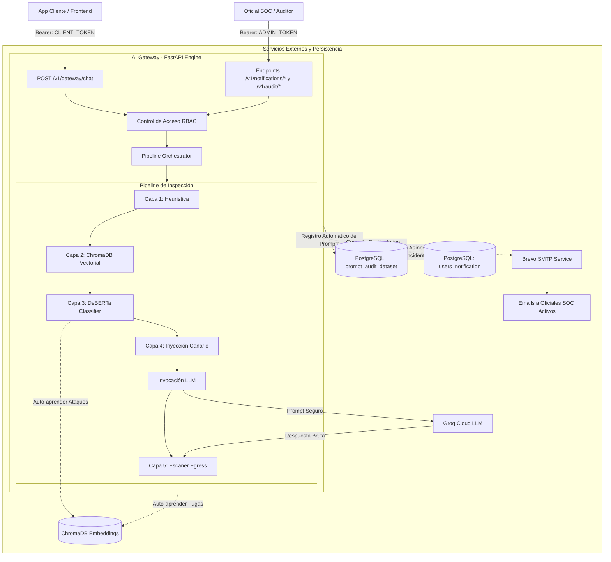

# 🏛️ Arquitectura del Sistema: AI Gateway Perimetral

Este documento describe la arquitectura de software, el diseño modular bajo principios de **Clean Architecture**, los flujos de datos y la integración de la base de datos relacional (PostgreSQL), la base vectorial (ChromaDB), el sistema de control de acceso por roles (RBAC) y las alertas en tiempo real.

---

## 1. Estructura y Organización Modular

El proyecto sigue una separación estricta de responsabilidades en capas:

```text
ai_gateway/
├── app/
│   ├── main.py                         # Application factory + Lifespan + Rutas
│   ├── api/                            # Capa de Controladores / Endpoints REST
│   │   ├── gateway.py                  # POST /v1/gateway/chat (Client Token)
│   │   ├── monitoring.py               # GET /health, POST /reset-vault
│   │   ├── notifications.py            # CRUD /v1/notifications/recipients (Admin Token)
│   │   └── audit.py                    # GET /v1/audit/records, POST /review, GET /export/seed
│   ├── core/                           # Capa de Dominio y Lógica Perimetral
│   │   ├── config.py                   # Pydantic Settings singleton (.env)
│   │   ├── security.py                 # RBAC (Client vs Admin Token) + Canarios
│   │   ├── metrics.py                  # Recolector de métricas in-memory
│   │   └── pipeline/                   # Orquestación de las 5 Capas de Seguridad
│   │       ├── manager.py              # Orquestador del flujo Ingress/Egress
│   │       ├── layer_1_heuristics.py   # Filtro Heurístico (<1ms)
│   │       ├── layer_2_vectorial.py    # Similitud Vectorial ChromaDB (5-20ms)
│   │       ├── layer_3_intelligence.py # Clasificador IA Transformer (25-60ms)
│   │       ├── layer_4_canary.py       # Inyección de Token Canario (<1ms)
│   │       └── layer_5_egress.py       # Escáner de Salida y Fugas (<2ms)
│   ├── db/                             # Capa de Persistencia Relacional
│   │   ├── session.py                  # Async Engine (asyncpg) + get_db + init_db
│   │   └── models.py                   # ORM: users_notification, prompt_audit_dataset
│   ├── services/                       # Capa de Integraciones Externas
│   │   ├── vector_db.py                # Wrapper persistente de ChromaDB
│   │   ├── llm_client.py               # Cliente asíncrono httpx para Groq Cloud
│   │   └── email_notifier.py           # Servicio de alertas SMTP vía Brevo
│   └── models/                         # Esquemas de Datos (Pydantic v2)
│       ├── schemas.py                  # Schemas de chat, telemetría y respuestas
│       └── schemas_admin.py            # Schemas de administración y auditoría HITL
├── frontend/                           # UI de Pruebas (Chat + Inspector en Vivo)
├── data/                               # Almacenamiento local de ChromaDB y seed dataset
├── sql/
│   └── create_tables.sql               # Script DDL para inicialización en PostgreSQL
└── docs/                               # Documentación de ingeniería y reportes
```

---

## 2. Diagrama de Arquitectura y Flujo de Componentes



---

## 3. Modelo de Datos Relacional (PostgreSQL)

### Tabla 1: `users_notification`
Gestiona dinámicamente la lista de destinatarios para incidentes de seguridad sin necesidad de reiniciar el microservicio.

```sql
CREATE TABLE users_notification (
    id          SERIAL PRIMARY KEY,
    first_name  VARCHAR(100) NOT NULL,
    last_name   VARCHAR(100) NOT NULL,
    ci          VARCHAR(30) NOT NULL UNIQUE,
    email       VARCHAR(255) NOT NULL UNIQUE,
    role        VARCHAR(50) NOT NULL DEFAULT 'SOC_ANALYST',
    is_active   BOOLEAN NOT NULL DEFAULT TRUE,
    created_at  TIMESTAMPTZ NOT NULL DEFAULT NOW(),
    updated_at  TIMESTAMPTZ NOT NULL DEFAULT NOW()
);
```

### Tabla 2: `prompt_audit_dataset`
Registra el 100% de las peticiones para análisis forense, telemetría y el flujo de etiquetado humano (*Human-in-the-Loop*).

```sql
CREATE TABLE prompt_audit_dataset (
    id                  SERIAL PRIMARY KEY,
    user_id             VARCHAR(64) NOT NULL,
    session_id          VARCHAR(64) NOT NULL,
    prompt_text         TEXT NOT NULL,
    predicted_threat    BOOLEAN NOT NULL,
    confidence_score    FLOAT,
    blocked_by_layer    VARCHAR(50),
    block_reason        TEXT,
    created_at          TIMESTAMPTZ NOT NULL DEFAULT NOW(),
    reviewed            BOOLEAN NOT NULL DEFAULT FALSE,
    is_threat           BOOLEAN,
    threat_category     VARCHAR(50),
    reviewed_by_ci      VARCHAR(30),
    reviewed_at         TIMESTAMPTZ
);
```

---

## 4. Control de Acceso por Roles (RBAC)

La autenticación utiliza comparación criptográfica en tiempo constante (`secrets.compare_digest`) sobre hashes **SHA-256**:

1. **Client Token (`ALLOWED_CLIENT_API_KEYS_HASHES`):**
   - Acceso exclusivo al consumo del chat seguro (`POST /v1/gateway/chat`).
   - Permite aislar a las aplicaciones finales de los datos de gobernanza interna.
2. **Admin Token (`ALLOWED_ADMIN_API_KEYS_HASHES`):**
   - Acceso a la gestión de personal de seguridad (`/v1/notifications/*`).
   - Acceso a la revisión y exportación de datos de auditoría (`/v1/audit/*`).
   - Acceso al reseteo de la memoria vectorial (`/v1/gateway/reset-vault`).