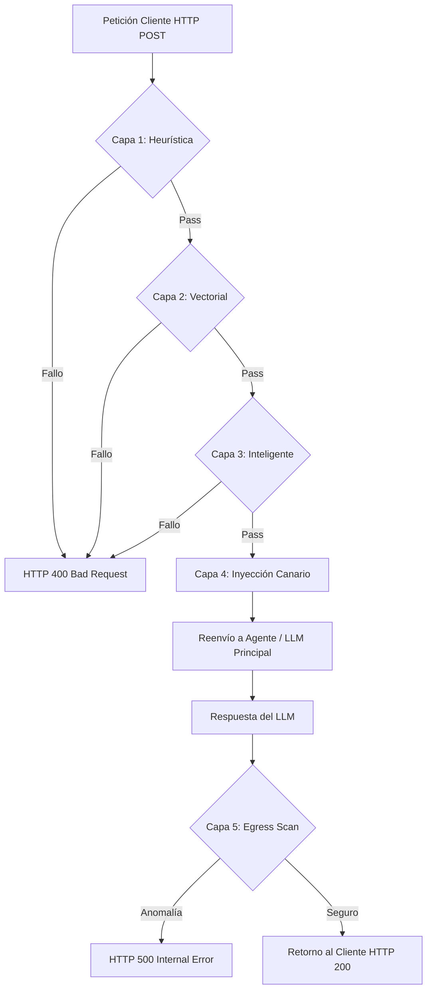

# ⚙️ Especificación de Ingeniería: AI Gateway Perimetral (Prototipo)

Este componente actúa como un **Proxy de Seguridad Interceptor**, diseñado para la detección temprana de ataques de inyección y la prevención de fuga de contexto mediante un pipeline de inspección profunda.

## 1. Requerimientos Técnicos y Stack Tecnológico

| Categoría | Tecnología Seleccionada | Propósito |
| :--- | :--- | :--- |
| **Entorno de Ejecución** | Python 3.10+ | Optimización de tipado y soporte asíncrono nativo. |
| **Servidor Web** | FastAPI + Uvicorn | Servidor ASGI de alto rendimiento. |
| **Documentación API** | **Scalar (OpenAPI)** | Interfaz interactiva de documentación en el path `/docs`. |
| **Seguridad de Entrada** | `llm-guard` (Protect AI) | Parsing heurístico y gestión de modelos de inyección. |
| **Base de Datos Vectorial** | `ChromaDB` | Motor embebido para firmas de ataques (In-Memory/Disco). |
| **Modelos de IA** | ONNX / Hugging Face | Clasificadores Transformer ligeros optimizados para CPU. |
| **Cliente HTTP** | `httpx` | Peticiones asíncronas hacia el backend/LLM. |
| **Criptografía** | Módulo `secrets` | Generación de tokens canarios de alta entropía. |

---

## 2. Arquitectura de Software y Pipeline de Ejecución

El procesamiento sigue un flujo lineal de 5 capas de seguridad, divididas en fases de **Ingreso (Ingress)** y **Egreso (Egress)**.

### Diagrama de Flujo Lógico

### Detalle de las Capas
1.  **Capa 1 (Heurística):** Bloqueo por palabras prohibidas y sintaxis maliciosa (Regex/BanSubstrings).
2.  **Capa 2 (Vectorial):** Comparación semántica en `ChromaDB` contra historial de ataques confirmados.
3.  **Capa 3 (Inteligente):** Clasificador de IA local (Prompt Guard) para detectar intención de *Jailbreak*.
4.  **Capa 4 (Canario):** Inyección de un identificador criptográfico único para rastrear el flujo de respuesta.
5.  **Capa 5 (Egress Scan):** Auditoría de salida para asegurar que el token canario no ha sido manipulado o revelado erróneamente por el LLM.

---

## 3. Especificación de Endpoints (API)

### 3.1. Documentación Técnica (Scalar)
**Ruta:** `GET /docs`

*   **Descripción:** Expone la especificación OpenAPI del Gateway mediante la interfaz de **Scalar**. Permite realizar pruebas de los endpoints en tiempo real, visualizar ejemplos de esquemas JSON y descargar la especificación para clientes externos.

### 3.2. Intercepción y Enrutamiento Seguro
**Ruta:** `POST /v1/gateway/chat`
*   **Cuerpo (JSON):** `{"user_id": "string", "session_id": "string", "message": "string"}`
*   **Respuesta 200:** Flujo seguro permitido.
*   **Respuesta 400:** Bloqueo en entrada (Ingress).
*   **Respuesta 500:** Bloqueo en salida (Egress - Fuga de datos detectada).

### 3.3. Monitoreo y Mantenimiento
*   **GET `/v1/gateway/health`:** Estadísticas de mitigación y salud de componentes.
*   **POST `/v1/gateway/reset-vault`:** Limpieza total de la memoria de ataques en `ChromaDB`.

---

## 4. Flujo de Inicialización y Calentamiento

1.  **Configuración de Scalar:** Durante el arranque, FastAPI genera el esquema OpenAPI y el Gateway monta la interfaz de **Scalar** en `/docs`, deshabilitando el Swagger UI convencional para unificar el acceso.
2.  **Persistencia Vectorial:** Inicializa `ChromaDB`. Si existe la carpeta `./gateway_vector_db`, recupera el conocimiento previo de ataques.
3.  **Model Warming:** Carga los micro-modelos clasificadores ONNX desde la caché a la memoria RAM para garantizar una latencia mínima desde la primera petición.
4.  **Async Pooling:** Configura el pool de conexiones `httpx` para una comunicación persistente con el LLM principal.

---

## 5. Matriz de Decisiones de Seguridad

| Escenario | Capa Activada | Acción del Gateway |
| :--- | :--- | :--- |
| Instrucción directa de "Override" | Capa 1 | Bloqueo por heurística inmediata. |
| Intento de ataque previamente mitigado | Capa 2 | Bloqueo por alta similitud vectorial. |
| Ingeniería social para bypass de reglas | Capa 3 | Bloqueo por clasificación de IA local. |
| Alucinación que revela reglas internas | Capa 5 | Intercepción de salida y registro en BD vectorial. |