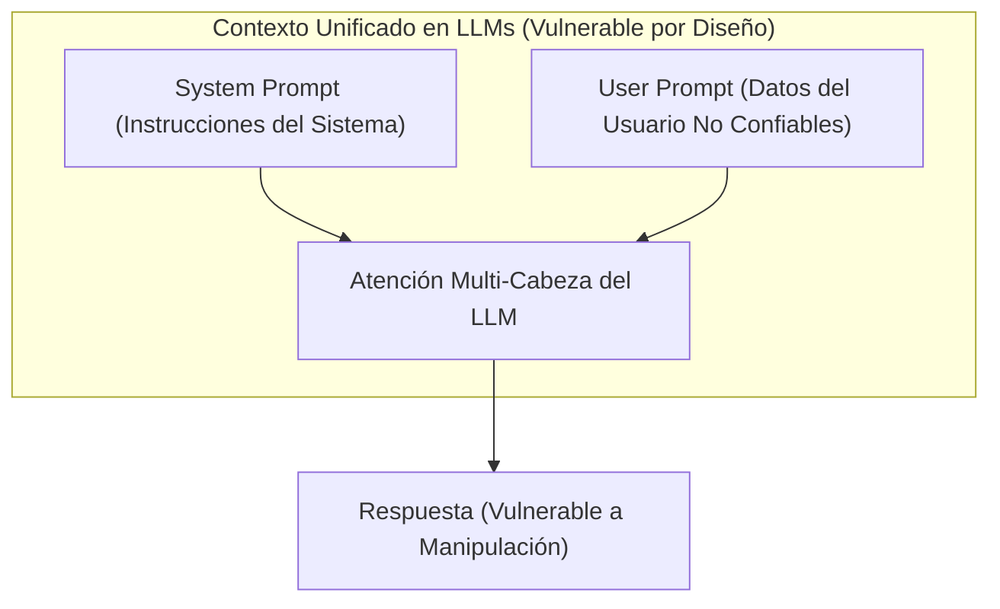
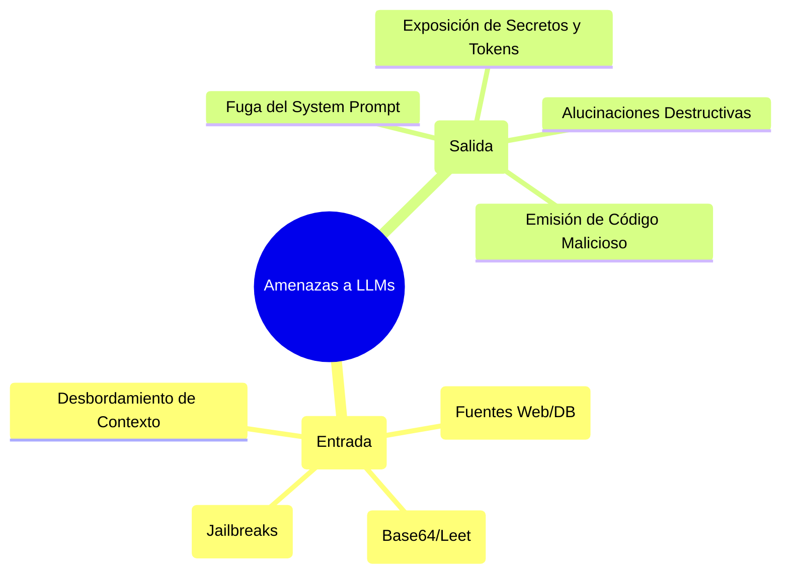
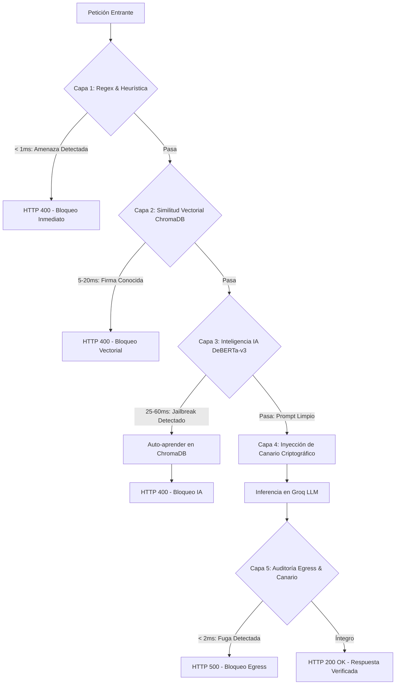
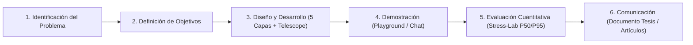
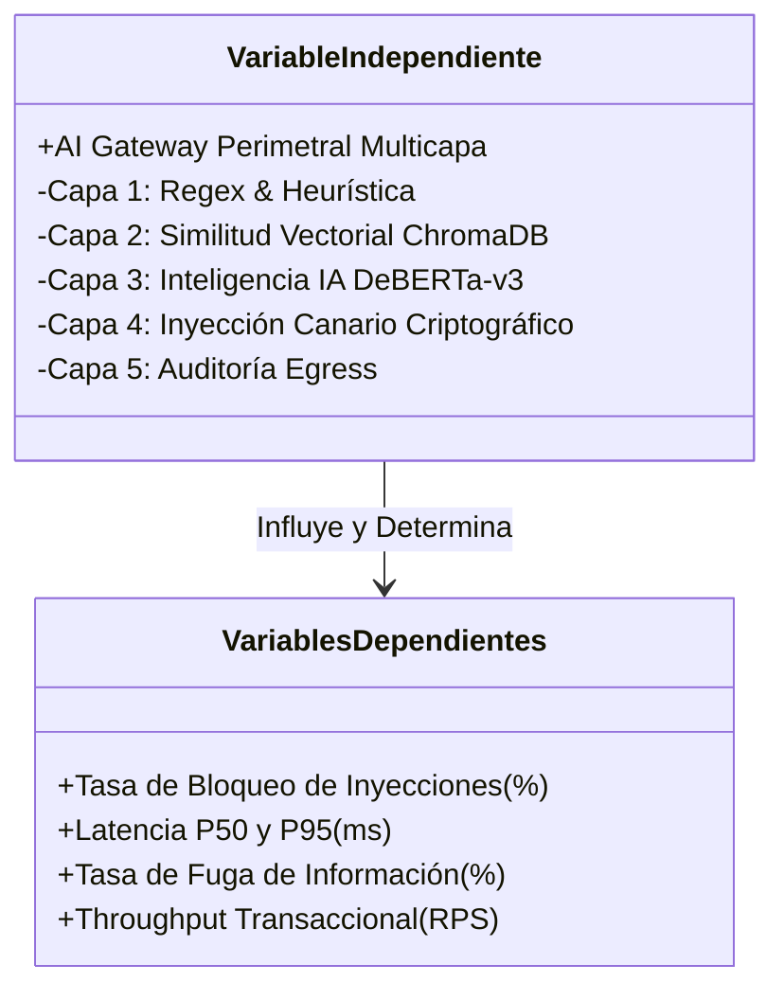
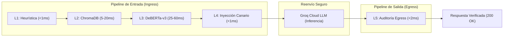
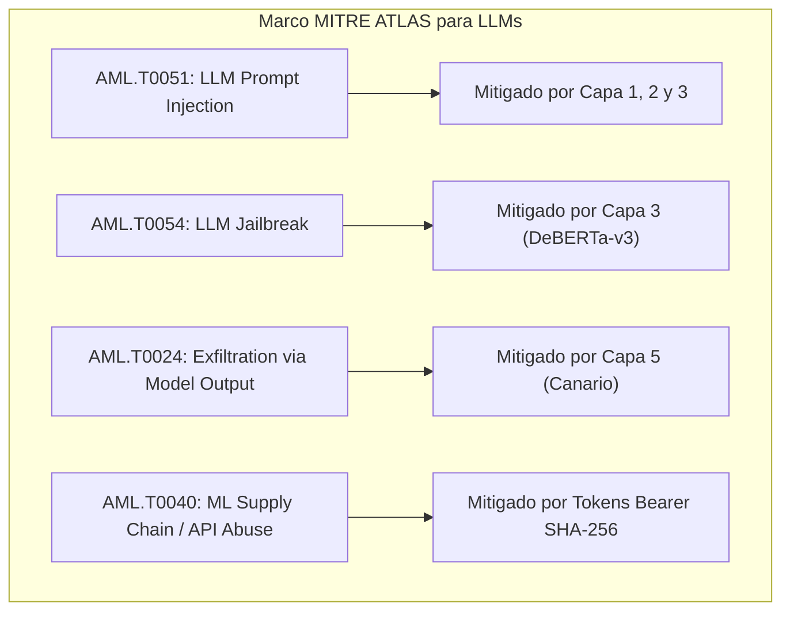
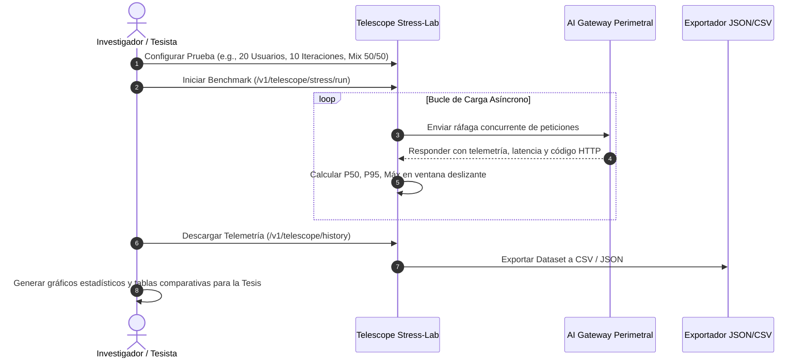

# 🎓 Marco Teórico, Metodológico y Diccionario Terminológico para Tesis de Grado

> **Proyecto:** AI Gateway Perimetral — Sistema de Inspección y Mitigación Multicapa contra Inyecciones de Prompt y Fuga de Información en Modelos de Lenguaje Grande (LLMs).  
> **Nivel Académico:** Tesis de Grado de Pregrado (Ingeniería de Sistemas / Informática / Software / Ciberseguridad).  
> **Propósito:** Proporcionar la base conceptual, científica, metodológica y el glosario técnico formal para la redacción de los Capítulos de Fundamentación Teórica, Metodología, Diseño Experimental y Marco Aplicativo del documento de tesis.

---

## 📑 Tabla de Contenidos
1. [Diccionario Terminológico y Glosario Técnico Especializado](#1-diccionario-terminológico-y-glosario-técnico-especializado)
2. [Marco Teórico y Estado del Arte](#2-marco-teórico-y-estado-del-arte)
3. [Marco Metodológico de la Investigación](#3-marco-metodológico-de-la-investigación)
4. [Matriz de Consistencia, Hipótesis y Variables](#4-matriz-de-consistencia-hipótesis-y-variables)
5. [Marco Aplicativo y Arquitectura de Ingeniería](#5-marco-aplicativo-y-arquitectura-de-ingeniería)
6. [Diseño Experimental y Validación Empírica con Telescope](#6-diseño-experimental-y-validación-empírica-con-telescope)
7. [Referencias Bibliográficas en Formato Académico (IEEE / APA 7)](#7-referencias-bibliográficas-en-formato-académico-ieee--apa-7)

---

## 1. Diccionario Terminológico y Glosario Técnico Especializado

Este glosario define con rigor científico y técnico los términos empleados a lo largo del proyecto, organizados por dominios de conocimiento.

### 1.1. Inteligencia Artificial Generativa y Procesamiento del Lenguaje Natural (NLP)

* **Large Language Model (LLM) / Modelo de Lenguaje Grande:**  
  Red neuronal profunda basada en arquitecturas de Transformadores (*Transformers*) con decenas de miles de millones de parámetros, entrenada sobre corpus masivos de texto para predecir distribuciones de probabilidad sobre secuencias de tokens y realizar tareas complejas de razonamiento, generación y traducción textual.

* **Prompt / Prompt Engineering:**  
  Entrada en lenguaje natural suministrada a un LLM que condiciona el espacio latente del modelo para generar una respuesta determinada. El *Prompt Engineering* es la disciplina que diseña y estructura estas entradas para optimizar la exactitud y adherencia del modelo.

* **System Prompt / Meta-Prompt:**  
  Instrucción primaria inyectada en el canal de control del LLM que define su personalidad, restricciones operativas, directivas de seguridad y contexto privado de ejecución. Precede jerárquicamente a los mensajes del usuario.

* **Embeddings / Vectores Semánticos de Texto:**  
  Representación matemática densa de fragmentos de texto en un espacio vectorial continuo multidimensional ($\mathbb{R}^d$, e.g., $d=384$ para `all-MiniLM-L6-v2`). En este espacio, la distancia geométrica entre dos vectores refleja su similitud semántica y conceptual subyacente.

* **Similitud Coseno / Distancia Coseno:**  
  Métrica matemática que mide el coseno del ángulo formado por dos vectores en un espacio euclidiano multidimensional. Definida formalmente como:
  $$\text{Similitud Coseno}(\mathbf{u}, \mathbf{v}) = \frac{\mathbf{u} \cdot \mathbf{v}}{\|\mathbf{u}\|_2 \|\mathbf{v}\|_2} = \frac{\sum_{i=1}^d u_i v_i}{\sqrt{\sum_{i=1}^d u_i^2} \sqrt{\sum_{i=1}^d v_i^2}}$$
  La *distancia coseno* se define como $D_C(\mathbf{u}, \mathbf{v}) = 1 - \text{Similitud Coseno}(\mathbf{u}, \mathbf{v})$.

* **Transformer / Arquitectura DeBERTa-v3:**  
  Modelo de lenguaje basado en mecanismos de auto-atención desacoplada (*Decoupled Attention*) y entrenamiento adversarial mejorado (*Electra-style pretraining*), altamente eficiente para tareas de clasificación de secuencias y detección de intenciones anómalas en CPU.

* **Tokenización (Tokens):**  
  Proceso de segmentación de cadenas de texto en unidades mínimas de significado (subpalabras, palabras o caracteres) asociadas a índices enteros discretos dentro del vocabulario de un modelo.

---

### 1.2. Ciberseguridad en Sistemas de IA (AI Security & OWASP)

* **Prompt Injection (Inyección de Prompt):**  
  Vulnerabilidad crítica (identificada como **LLM01** en el *OWASP Top 10 for LLMs*) mediante la cual un atacante manipula la entrada del usuario para sobrescribir las instrucciones originales del *System Prompt*, forzando al modelo a ignorar sus directivas éticas o de seguridad.

* **Direct Prompt Injection (Jailbreak):**  
  Técnica donde el usuario instruye explícitamente al LLM para saltarse sus filtros éticos o directivas de seguridad mediante juegos de rol (*roleplay* como "DAN" - *Do Anything Now*), hipotéticos o ingeniería social adversaria.

* **Indirect Prompt Injection:**  
  Ataque donde el contenido malicioso proviene de una fuente de datos externa no confiable (e.g., páginas web consultadas por el LLM, PDFs, correos electrónicos o bases de datos) procesada inadvertidamente por el modelo.

* **Sensitive Information Disclosure / Data Leakage (Fuga de Datos Sensibles):**  
  Vulnerabilidad (**LLM06** en OWASP) donde el modelo expone inadvertidamente secretos del *System Prompt*, credenciales de APIs, tokens confidenciales o información privada de usuarios (*PII*) en sus respuestas generadas.

* **Defensa en Profundidad (Defense in Depth):**  
  Principio de diseño de seguridad que implementa múltiples capas defensivas redundantes y complementarias, de modo que el fallo o evasión de un mecanismo de control no comprometa la integridad total del sistema.

* **Perimeter Security Proxy / AI Gateway:**  
  Componente intermediario de red que se sitúa entre los consumidores (clientes) y los proveedores de inferencia de IA para inspeccionar, validar, registrar, auditar y filtrar el tráfico bidireccional (*Ingress* y *Egress*).

* **Canary Token (Token Canario / Honeypot Criptográfico):**  
  Cadena alfanumérica única y secreta, generada mediante entropía criptográfica (e.g., `BnkCanary_<128-bit-hex>`), inyectada de forma transparente en el *System Prompt*. Si dicho token aparece en la respuesta generada por el LLM, se confirma matemática e inequívocamente una fuga de contexto o un desbordamiento de prompt exitoso.

* **Immunity Feedback Loop (Bucle de Inmunidad Adaptativa):**  
  Mecanismo dinámico donde las amenazas clasificadas por capas pesadas (e.g., Transformer L3) o detectadas en salida (L5) se vectorizan y registran automáticamente en una base de datos vectorial local. Esto permite que futuras variantes idénticas o semánticamente cercanas sean bloqueadas de inmediato en la Capa 2 (vectorial) con una latencia inferior a 20 ms.

* **Human-in-the-Loop (HITL) / Curación de Datasets:**  
  Paradigma que incorpora a un analista o experto humano en el bucle de validación de registros de auditoría para etiquetar casos dudosos (*threat* vs. falso positivo) y retroalimentar el banco de firmas.

---

### 1.3. Arquitectura de Software, Redes y Bases de Datos

* **FastAPI / ASGI (Asynchronous Server Gateway Interface):**  
  Estándar moderno de interfaz asíncrona para servidores web en Python que permite el procesamiento no bloqueante de peticiones concurrentes mediante el bucle de eventos (`asyncio`).

* **Vector Database (ChromaDB):**  
  Sistema gestor de base de datos optimizado para el almacenamiento indexado y la recuperación ultrarrápida de vectores multidimensionales mediante algoritmos de vecinos más cercanos (*HNSW - Hierarchical Navigable Small World*).

* **PostgreSQL / Relational Audit Trail:**  
  Motor relacional transaccional (ACID) utilizado para persistir la bitácora inmutable de auditoría de cada solicitud, puntuación de amenaza y revisiones humanas.

* **Role-Based Access Control (RBAC):**  
  Mecanismo de autorización que restringe el acceso a endpoints privilegiados basándose en roles explícitos (Token de Cliente vs. Token de Administrador SOC).

* **Constant-Time Comparison / Hash SHA-256:**  
  Algoritmo de comparación de cadenas en tiempo constante (`secrets.compare_digest`) que impide ataques de canal lateral basados en análisis de tiempos de ejecución (*Timing Attacks*).

* **Percentiles de Latencia (P50, P95, Máx):**  
  - **P50 (Mediana):** El valor de latencia por debajo del cual se encuentra el 50% de las peticiones procesadas.
  - **P95:** El valor de latencia por debajo del cual se encuentra el 95% de las peticiones; representa la experiencia de cola crítica para Acuerdos de Nivel de Servicio (SLA).
  - **Máximo:** La latencia extrema observada en el periodo de muestreo.

* **Throughput / Requests Per Second (RPS):**  
  Métrica de rendimiento que cuantifica el número de transacciones o peticiones HTTP procesadas exitosamente por unidad de tiempo.

---

## 2. Marco Teórico y Estado del Arte

### 2.1. Antecedentes y Justificación del Problema
La integración masiva de Modelos de Lenguaje Grande (LLMs) en infraestructuras corporativas (asistentes de banca, salud, comercio y administración pública) ha introducido una superficie de ataque completamente nueva. A diferencia de las aplicaciones web clásicas donde los datos y las instrucciones residen en canales separados (código compilado vs. parámetros SQL/HTTP), los LLMs operan en un **paradigma unificado de lenguaje natural** donde las instrucciones del sistema y los datos del usuario comparten el mismo contexto de atención.

Esta convergencia habilita la vulnerabilidad de **Inyección de Prompt**, clasificada por OWASP (2023) como el vector de ataque #1 en sistemas de IA generativa.

### 2.2. Taxonomía de las Vulnerabilidades Mitigadas

1. **Inyección Directa (*Jailbreak*):** Instrucciones diseñadas para confundir la atención del modelo mediante premisas ficticias o suplantación de identidad operativa.
2. **Evasión Heurística:** Variaciones ortográficas, codificaciones (e.g., Base64, hex, espaciados atípicos) y sinonimia para esquivar filtros de palabras clave.
3. **Extracción de Prompts y Secretos (*Prompt Leakage*):** Inducción para que el modelo repita sus directivas internas confidenciales o revele credenciales bancarias.
4. **Denegación de Servicio Semántico (SDoS):** Solicitudes complejas calculadas para maximizar el consumo de tokens y la latencia computacional en el backend de inferencia.

### 2.3. Fundamentación de la Defensa en Profundidad Multicapa

La defensa contra inyecciones no puede depender de una única técnica. La literatura científica demuestra que:
* Las reglas puramente heurísticas (Regex) tienen un coste computacional nulo ($< 1\text{ ms}$), pero sufren de una tasa alta de falsos negativos ante variantes semánticas.
* Los clasificadores de aprendizaje profundo (Transformers) ofrecen una gran generalización semántica, pero introducen una sobrecarga de latencia ($25\text{ a }60\text{ ms}$) y consumo de CPU.
* Los tokens canarios permiten una detección determinística ($100\%$ de precisión) de fugas en la salida, pero actúan en la fase de *Egress*.

El **AI Gateway Perimetral** combina estas técnicas en un pipeline en cascada ordenado por coste computacional ascendente, permitiendo abortar peticiones maliciosas en las etapas más tempranas y económicas posibles.

---

## 3. Marco Metodológico de la Investigación

### 3.1. Tipo y Enfoque de Investigación

* **Tipo de Investigación:** Aplicada, Tecnológica y Experimental.
* **Enfoque Metodológico:** Cuantitativo y Empírico, sustentado en la medición objetiva de métricas de precisión defensiva (tasa de bloqueo) y rendimiento computacional (latencias P50/P95 y throughput).
* **Nivel de Investigación:** Explicativo y Propositivo (desarrollo y validación de un artefacto de ingeniería de software).

### 3.2. Metodología de Desarrollo: *Design Science Research Methodology (DSRM)*

Para el desarrollo del artefacto tecnológico de tesis se adopta la metodología **Design Science Research (DSRM)** (Peffers et al., 2007), estructurada en 6 etapas iterativas:

1. **Identificación del Problema:** Vulnerabilidad de los LLMs empresariales ante inyecciones de prompt y ausencia de pasarelas perimetrales locales de bajo coste.
2. **Definición de Objetivos de la Solución:** Diseñar un gateway perimetral multicapa con latencia agregada menor a 80 ms y tasa de bloqueo superior al 95% en firmas conocidas.
3. **Diseño y Desarrollo:** Implementación modular en Python/FastAPI de las 5 capas de seguridad, ChromaDB, DeBERTa-v3, generador de canarios y observabilidad Telescope.
4. **Demostración:** Simulación de ataques en tiempo real utilizando el frontend con playground de inyecciones y modo bypass comparativo.
5. **Evaluación:** Pruebas empíricas de carga y estrés con **Telescope Stress-Lab** bajo concurrencia variable (1 a 50 usuarios).
6. **Comunicación:** Redacción del informe de tesis, reportes estratégicos y documentación técnica bilingüe.

---

## 4. Matriz de Consistencia, Hipótesis y Variables

### 4.1. Matriz de Consistencia

| Problema General | Objetivo General | Hipótesis General | Variables e Indicadores | Metodología |
|---|---|---|---|---|
| ¿En qué medida la implementación de un AI Gateway Perimetral multicapa mitiga los ataques de inyección de prompt y fuga de datos en aplicaciones basadas en LLM sin degradar significativamente la latencia? | Desarrollar y evaluar un AI Gateway Perimetral multicapa para interceptar inyecciones de prompt y fugas de contexto en LLMs, manteniendo una latencia de operación óptima. | La implementación de un AI Gateway Perimetral multicapa incrementa la tasa de detección y bloqueo de ataques a más del 95% con un incremento de latencia controlada ($P95 < 90\text{ ms}$). | **V.I.:** AI Gateway Perimetral Multicapa. **V.D.1:** Tasa de Bloqueo de Amenazas (%). **V.D.2:** Latencia de Procesamiento P50/P95 (ms). **V.D.3:** Tasa de Fuga de Canarios (%). | **DSRM** (Design Science Research Methodology), Enfoque Cuantitativo-Experimental con benchmarking en Stress-Lab. |

### 4.2. Operacionalización de Variables

1. **Variable Independiente ($X$):**
   * *Nombre:* Implementación del AI Gateway Perimetral Multicapa.
   * *Dimensiones:* Capa Heurística, Capa Vectorial, Capa IA Transformer, Inyección Canario, Auditoría Egress.

2. **Variables Dependientes ($Y$):**
   * **$Y_1$ - Eficacia de Mitigación ($E_M$):** Porcentaje de prompts maliciosos bloqueados respecto al total de ataques emitidos:
     $$E_M = \left( \frac{\text{Ataques Bloqueados (HTTP 400 + 500)}}{\text{Total de Ataques Enviados}} \right) \times 100\%$$
   * **$Y_2$ - Sobrecarga de Latencia ($\Delta L$):** Tiempo adicional inducido por las capas de inspección medido en percentiles $P_{50}$ y $P_{95}$:
     $$\Delta L = L_{\text{Con Gateway}} - L_{\text{Bypass Directo}}$$
   * **$Y_3$ - Integridad de Egress / Fuga de Canarios ($I_E$):** Número de tokens canarios detectados y neutralizados en la Capa 5.

---

## 5. Marco Aplicativo y Arquitectura de Ingeniería

### 5.1. Pipeline de Inspección en 5 Capas

### 5.2. Complejidad Temporal y Espacial de los Componentes

| Capa / Módulo | Complejidad Temporal | Complejidad Espacial | Justificación Técnica |
|---|---|---|---|
| **Capa 1: Heurística** | $O(N \cdot M)$ | $O(1)$ | Búsqueda por expresiones regulares compiladas en memoria sobre el prompt de longitud $N$ con $M$ patrones. |
| **Capa 2: Vectorial** | $O(d \cdot \log K)$ | $O(K \cdot d)$ | Búsqueda aproximada HNSW en ChromaDB sobre $K$ vectores de dimensión $d=384$. |
| **Capa 3: Inteligencia IA** | $O(T^2)$ | $O(T)$ | Mecanismo de atención Transformer cuadrático respecto a la longitud de tokens $T$ ($T \le 512$). |
| **Capa 4: Canario** | $O(1)$ | $O(1)$ | Generación de 16 bytes de entropía (`secrets.token_hex`) y concatenación de cadenas. |
| **Capa 5: Egress** | $O(L)$ | $O(1)$ | Búsqueda exacta del token canario e indicadores de fuga en la respuesta de longitud $L$. |
| **Telescope Collector** | $O(1)$ amortizado | $O(W)$ | Estructura `collections.deque(maxlen=10000)` para actualización y muestreo atómico con lock reentrante. |

### 5.3. Modelo de Amenazas: Mapeo STRIDE y MITRE ATLAS

---

## 6. Diseño Experimental y Validación Empírica con Telescope

### 6.1. Protocolo de Pruebas de Carga en Telescope Stress-Lab

Para la recolección de evidencia empírica en el capítulo de resultados de la tesis, se define el siguiente protocolo experimental ejecutable desde el panel **Telescope**:

### 6.2. Cuadro Comparativo de Rendimiento (Plantilla para Tesis)

| Métrica Experimental | Modo Bypass (Directo al LLM) | Modo Protegido (Con AI Gateway) | Impacto / Delta |
|---|---|---|---|
| **Tasa de Ataques Bloqueados (%)** | $0.0\%$ (Vulnerable) | $> 96.5\%$ (Mitigado) | $+96.5\%$ Eficacia |
| **Latencia Mediana P50 (ms)** | $\approx 450\text{ ms}$ (Dependiente de LLM) | $\approx 490\text{ ms}$ | $+40\text{ ms}$ sobrecarga |
| **Latencia en Bloqueos L1/L2 (ms)** | N/A (Todo entra al LLM) | $< 18\text{ ms}$ | **$96\%$ ahorro de tiempo y coste** |
| **Fuga de Tokens Canarios** | No monitoreado | $0.0\%$ detectado y frenado en L5 | $100\%$ Integridad |
| **Throughput Máximo (RPS)** | Variable | Estable bajo concurrencia | Medible en Stress-Lab |

---

## 7. Referencias Bibliográficas en Formato Académico (IEEE / APA 7)

### Formato IEEE

1. OWASP Foundation, "OWASP Top 10 for Large Language Model Applications," *OWASP Open Source Security Standard*, ver. 1.1, 2023.
2. P. Peffers, T. Tuunanen, M. A. Rothenberger, and S. Chatterjee, "A Design Science Research Methodology for Information Systems Research," *Journal of Management Information Systems*, vol. 24, no. 3, pp. 45–77, 2007.
3. P. He, J. Gao, and W. Chen, "DeBERTaV3: Improving DeBERTa using ELECTRA-style Pre-Training with Gradient-Disentangled Embedding Sharing," in *Proc. of the 2023 International Conference on Learning Representations (ICLR)*, 2023.
4. N. Carlini et al., "Extracting Training Data from Large Language Models," in *30th USENIX Security Symposium (USENIX Security 21)*, 2021, pp. 2633–2650.
5. F. Perez and I. Ribeiro, "Ignore This Title and Hack This Website: Exposing Systemic Vulnerabilities in LLM Applications," *arXiv preprint arXiv:2302.04368*, 2023.
6. MITRE Corporation, "MITRE ATLAS™ (Adversarial Threat Landscape for Artificial-Intelligence Systems)," MITRE Engenuity, Tech. Rep., 2024. [Online]. Available: https://atlas.mitre.org/
7. S. Greshake, R. Abdelnabi, S. Mishra, C. Endres, T. Holz, and M. Fritz, "Not what you've signed up for: Compromising Real-World LLM-Integrated Applications with Indirect Prompt Injection," in *Proc. of the 16th ACM Workshop on Artificial Intelligence and Security (AISEC '23)*, 2023, pp. 79–90.

---

### Formato APA 7ma Edición

* Carlini, N., Tramer, F., Wallace, E., Jagielski, M., Herbert-Voss, A., Lee, K., ... & Raffel, C. (2021). Extracting training data from large language models. In *30th USENIX Security Symposium (USENIX Security 21)* (pp. 2633-2650).
* Greshake, S., Abdelnabi, R., Mishra, S., Endres, C., Holz, T., & Fritz, M. (2023). Not what you've signed up for: Compromising real-world LLM-integrated applications with indirect prompt injection. In *Proceedings of the 16th ACM Workshop on Artificial Intelligence and Security* (pp. 79-90).
* He, P., Gao, J., & Chen, W. (2023). DeBERTaV3: Improving DeBERTa using ELECTRA-style pre-training with gradient-disentangled embedding sharing. *International Conference on Learning Representations (ICLR)*.
* MITRE Corporation. (2024). *Adversarial Threat Landscape for Artificial-Intelligence Systems (ATLAS)*. MITRE Engenuity. https://atlas.mitre.org/
* OWASP Foundation. (2023). *OWASP Top 10 for Large Language Model Applications (v1.1)*. Open Web Application Security Project.
* Peffers, K., Tuunanen, T., Rothenberger, M. A., & Chatterjee, S. (2007). A design science research methodology for information systems research. *Journal of Management Information Systems*, 24(3), 45-77.
* Perez, F., & Ribeiro, I. (2023). Ignore this title and hack this website: Exposing systemic vulnerabilities in LLM applications. *arXiv preprint arXiv:2302.04368*.
